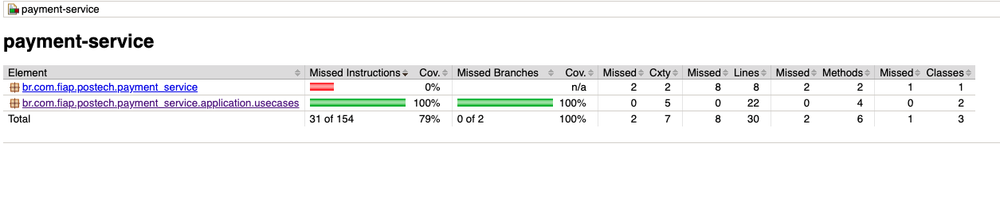

# Payment Service

## Prerequisites

Ensure you have the following installed on your local machine:

- Docker
- Java JDK

## Setting Up Your Local Environment

1. **Clone the repository:**
   First, clone the `customer-service` repository to your local machine. You can do this by running the following command in your terminal:

    ```bash
    git clone git@github.com:postech-food-challenge/payment-service.git
    ```

   Navigate to the project directory:

    ```bash
    cd payment-service
    ```

2. **Run application:**
   In order to run the application locally, a few steps need to be performed:

    1. Give execute permission to `init-aws.sh`
       ```bash
        chmod +x ./scripts/init-aws.sh
        ```
    2. **Run docker-compose script:** In the root folder, run:
       ```bash
        docker compose up -d
        ```
       This command will start both payment-service, it's database and localstack

That's it! Your local development environment for running customer-service is set up, and you should be able to test our application.

## Postman
You can find the collection for this API by clicking the button bellow

[](https://www.postman.com/altimetry-pilot-78705804/workspace/postech-paymentservice/overview)

## Software Structure
The architecture implemented in our software is the Clean Architecture. Below is a drawing representing this architecture:


## Coverage

